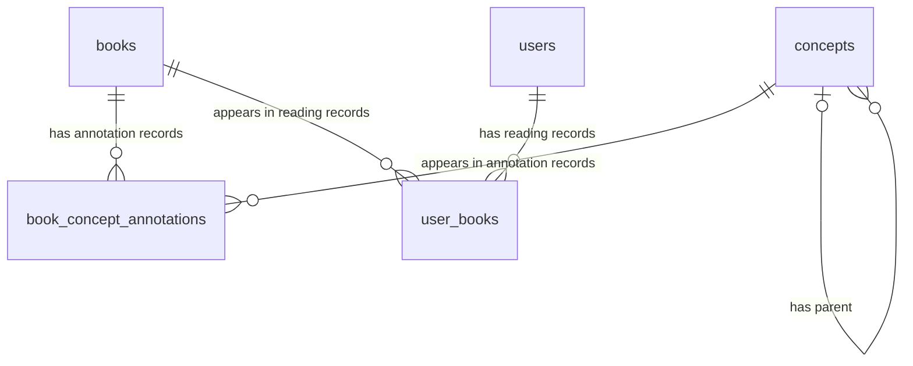

# Atlas Schema (v1)

## 1. Overview

Atlas’s database stores the core data needed to support a knowledge-gap-aware investing and trading book recommender system. In this project, knowledge gaps refer to under-covered concepts in a user’s current reading history. The database keeps canonical book records, represents the investing/trading taxonomy, stores audited book-to-concept mappings, and tracks which books each user has read. Together, these tables allow Atlas to infer a user’s current concept coverage and recommend books that fill gaps rather than simply recommending similar books.

The v1 schema contains five core tables:

- `books` — Stores the canonical record for each book.
- `concepts` — Represents the investing/trading taxonomy.
- `book_concept_annotations` — Maps books to the concepts they cover.
- `users` — Identifies users in the system.
- `user_books` — Tracks which books each user has read.

## 2. Design Principles

### Raw SQL Migrations First

The initial schema is defined using raw SQL migrations rather than Alembic autogeneration. This was chosen so the database structure remains explicit and easy to inspect while the project is still in its early design stage. SQLAlchemy ORM models should be written to match the SQL schema, not used to hide or replace understanding of it.

### pgvector Enabled at the Database Level

The PostgreSQL `vector` extension is enabled in the initial migration to support future embedding-based retrieval. Atlas v1 is primarily taxonomy-driven, but embeddings may later support semantic search, book similarity, metadata enrichment, or hybrid recommendations. Enabling pgvector early keeps the database foundation compatible with those future retrieval paths.

### UUID Primary Keys

All core tables use UUID primary keys rather than sequential integer IDs. This is mostly a greenfield project default: UUIDs are stable API-facing identifiers, avoid exposing insertion order, and keep future import or merge workflows simpler at negligible cost for v1 scale. The tradeoff is that UUIDs are less readable and slightly larger than integer keys, but that is acceptable for this project.

### Controlled Annotation Strength Values

Book-to-concept annotation strength uses three fixed values: `1.0` for confirmed, `0.5` for weak, and `0.3` for conditional. This was chosen instead of a continuous `0.0–1.0` score because the audit process produces categorical human judgments, not precise measurements. Downstream recommender logic should treat these values as semantic weights rather than arbitrary confidence scores.

### Timestamp Convention

Every table includes `created_at TIMESTAMPTZ NOT NULL DEFAULT NOW()`. No table includes `updated_at` in v1 because the schema currently treats records as mostly append-only after creation. If mutation tracking becomes necessary later, adding `updated_at` should be handled through a future migration because it would change how application code is expected to update and audit records.

### Foreign Key Delete Semantics

All foreign keys use `ON DELETE CASCADE`. This was chosen because dependent rows have no useful meaning without their parent records: a book-concept annotation is meaningless without its book or concept, a user-book row is meaningless without its user or book, and a leaf concept is meaningless without its parent category. The `concepts.parent_id` self-reference also cascades, which is acceptable in v1 because the taxonomy is treated as frozen after initialization.

## 3. Entity-Relationship Diagram

The diagram below shows the foreign key relationships between the five tables in the v1 schema.

This schema has three relationship structures:

- **Books ↔ Concepts (many-to-many)** through `book_concept_annotations`. Each annotation row records that a book covers a concept, along with the strength and source of that mapping.
- **Concept self-reference** through `concepts.parent_id`. Parent categories have no parent, while leaf concepts point to a parent category.
- **Users ↔ Books (many-to-many)** through `user_books`. Each row records that a user has read a specific book.

## 4. Tables

### 4.1 `books`

**Purpose:**
Stores the canonical metadata record for each book that Atlas can annotate, recommend, or attach to a user’s reading history.

**Columns:**

| Column | Type | Constraints | Notes |
|---|---|---|---|
| `id` | `UUID` | Primary key | See Section 2: UUID Primary Keys. |
| `title` | `VARCHAR(512)` | `NOT NULL` |  |
| `author` | `VARCHAR(512)` | `NOT NULL` | Single display string, even for multi-author books. Multi-author splitting is deferred; see Open Questions. |
| `isbn_13` | `CHAR(13)` | `UNIQUE`, nullable | Stores normalized 13-digit ISBNs. `CHAR(13)` requires application-side normalization before insertion because PostgreSQL pads shorter strings with spaces, which can silently break uniqueness assumptions. |
| `description` | `TEXT` | Nullable | Usually imported from external metadata sources. |
| `page_count` | `INTEGER` | Nullable | Nullable because metadata APIs may not always provide this. |
| `publication_year` | `INTEGER` | Nullable | Stores year only, not full publication date, because year-level precision is enough for v1. |
| `cover_url` | `TEXT` | Nullable | Stores a URL reference, not the image file itself. |
| `source` | `VARCHAR(64)` | `NOT NULL`, default `'manual'` | Expected values: `manual`, `google_books`, `open_library`. Tracks metadata provenance so suspicious records can be traced back to their origin. |
| `created_at` | `TIMESTAMPTZ` | `NOT NULL`, default `NOW()` | See Section 2: Timestamp Convention. |

**Relationships:**

- Referenced by `book_concept_annotations.book_id`.
- Referenced by `user_books.book_id`.

**Design notes:**

`books` is a canonical global table, not a user-specific table. A book should exist once in `books`, while user-specific reading history is stored separately in `user_books`.

`isbn_13` is nullable because some records may be added manually before ISBN metadata is available, and some books or editions may not resolve cleanly through external APIs.

**Open questions:**

- Should authors become a separate table to support multi-author books and author-level deduplication? Likely needed once the corpus exceeds roughly 500 books or when author-based recommendations are introduced.
- Should `source` become a constrained enum or lookup table? Likely needed once automated ingestion is stable or more than three metadata sources are actively used.
- Should ISBN validation be enforced directly in the database with a format check? Likely needed once ISBN-based deduplication becomes part of the ingestion pipeline.

### 4.2 `concepts`

**Purpose:**
Stores the investing/trading taxonomy that Atlas uses to measure book coverage and identify user knowledge gaps.

**Columns:**

| Column | Type | Constraints | Notes |
|---|---|---|---|
| `id` | `UUID` | Primary key | See Section 2: UUID Primary Keys. |
| `name` | `VARCHAR(256)` | `NOT NULL` | Human-readable concept name used for display. |
| `slug` | `VARCHAR(256)` | `NOT NULL`, `UNIQUE` | Stable code-safe identifier, such as `risk_management` or `position_sizing`. Slugs should be normalized at the application/data-ingestion layer and treated as a stable contract once referenced by code. |
| `description` | `TEXT` | Nullable | Human-authored concept definition, usually derived from the taxonomy YAML. |
| `level` | `INTEGER` | `NOT NULL`, `CHECK (level IN (0, 1))` | `0` represents parent categories; `1` represents leaf concepts. |
| `parent_id` | `UUID` | Nullable, FK to `concepts.id`, `ON DELETE CASCADE` | Used for the taxonomy hierarchy. Parent categories have `parent_id = NULL`; leaf concepts point to their parent category. |
| `created_at` | `TIMESTAMPTZ` | `NOT NULL`, default `NOW()` | See Section 2: Timestamp Convention. |

**Relationships:**

- Self-references through `concepts.parent_id`.
- Referenced by `book_concept_annotations.concept_id`.

**Design notes:**

Parent categories and leaf concepts are stored in one self-referencing `concepts` table instead of separate `categories` and `leaf_concepts` tables. This keeps the taxonomy model compact because both levels share the same metadata shape.

The `level` column distinguishes parent categories from leaf concepts. Gap detection should normally operate only on leaf concepts, meaning recommender queries should filter for `level = 1`.

The v1 taxonomy is intentionally limited to two levels: parent categories and leaf concepts. Allowing deeper nesting would require changes to gap detection, coverage scoring, and recommendation explanations, so deeper taxonomy support is deferred.

**Open questions:**

- Should the database enforce the rule that `level = 0` requires `parent_id IS NULL` and `level = 1` requires `parent_id IS NOT NULL`? Currently this is treated as a data convention unless enforced in the migration.
- Should the two-level taxonomy constraint be relaxed later to support sub-leaves, such as splitting `position_sizing` into `kelly_sizing` and `fixed_fraction_sizing`?
- Should `description` become `NOT NULL` once the taxonomy is fully finalized and loaded from `data/taxonomy_v0.1.yaml`?
- Should column-length conventions be standardized across tables, such as using `VARCHAR(256)` consistently for short labels and identifiers?

### 4.3 `book_concept_annotations`

**Purpose:**
Stores the audited mappings between books and taxonomy concepts, including how strongly each book covers each concept.

**Columns:**

| Column | Type | Constraints | Notes |
|---|---|---|---|
| `book_id` | `UUID` | `NOT NULL`, FK to `books.id`, `ON DELETE CASCADE` | Identifies the book being annotated; see Section 2: Foreign Key Delete Semantics. |
| `concept_id` | `UUID` | `NOT NULL`, FK to `concepts.id`, `ON DELETE CASCADE` | Identifies the concept covered by the book; see Section 2: Foreign Key Delete Semantics. |
| `strength` | `FLOAT` | `NOT NULL`, `CHECK (strength IN (1.0, 0.5, 0.3))` | See Section 2: Controlled Annotation Strength Values. |
| `annotation_type` | `VARCHAR(32)` | `NOT NULL`, default `'manual'` | Expected v1 values are `manual` and `model`; currently not database-constrained. |
| `created_at` | `TIMESTAMPTZ` | `NOT NULL`, default `NOW()` | See Section 2: Timestamp Convention. |

**Table-level constraints:**

- `UNIQUE (book_id, concept_id, annotation_type)` prevents duplicate annotations of the same type for the same book-concept pair.

**Relationships:**

- `book_id` references `books.id`.
- `concept_id` references `concepts.id`.
- Acts as the join table for the many-to-many relationship between `books` and `concepts`.

**Design notes:**

This table does not use a surrogate `id` column. Its effective identity is the combination of `book_id`, `concept_id`, and `annotation_type`, because an annotation only exists to describe the relationship between a specific book, a specific concept, and a specific source of annotation.

The current migration enforces this identity with a `UNIQUE (book_id, concept_id, annotation_type)` constraint rather than a declared composite primary key. This is acceptable for v1, but it should be revisited when writing SQLAlchemy models because ORMs usually expect each mapped table to have a primary key.

The inclusion of `annotation_type` in the uniqueness constraint allows manual and model-generated annotations to coexist for the same book-concept pair. For example, Atlas can store one `manual` annotation and one `model` annotation for the same book and concept without conflict, while still preventing duplicate manual annotations.

Manual annotations should be treated as the trusted source in v1. Future model annotations should be treated as evidence to review or compare against manual labels, not as equivalent ground truth by default.

`strength` should be interpreted as an evidence weight for coverage, not as a probability. A `1.0` annotation means the book clearly covers the concept; it does not mean there is a 100% probability that the user has mastered the concept after reading the book.

**Open questions:**

- Should `UNIQUE (book_id, concept_id, annotation_type)` be promoted to a composite primary key? This may become necessary when defining SQLAlchemy ORM models.
- Should `annotation_type` get a `CHECK` constraint such as `CHECK (annotation_type IN ('manual', 'model'))` to prevent typos like `Manual` or `manuaL`?
- Should the table include `created_by` or `annotator_id` once more than one person can create manual annotations?
- Should this table be the first to receive `updated_at`, since re-annotation requires updating existing rows rather than inserting duplicates?

### 4.4 `users`

**Purpose:**
Stores the minimal user identity record needed to attach reading history to a person.

**Columns:**

| Column | Type | Constraints | Notes |
|---|---|---|---|
| `id` | `UUID` | Primary key | See Section 2: UUID Primary Keys. |
| `email` | `VARCHAR(256)` | `NOT NULL`, `UNIQUE` | Functions as a secondary unique identifier for users. |
| `created_at` | `TIMESTAMPTZ` | `NOT NULL`, default `NOW()` | See Section 2: Timestamp Convention. |

**Relationships:**

- Referenced by `user_books.user_id`.

**Design notes:**

`users` is intentionally minimal in v1. Atlas needs enough user identity to connect a person to their reading history, but it does not yet model full authentication, profiles, passwords, names, roles, or account settings.

Authentication is treated as outside the database scope for v1. If Atlas later integrates with an external auth provider or adds first-party authentication, this table will need to be extended deliberately rather than implicitly.

**Open questions:**

- Should authentication remain external, or should Atlas eventually store auth-related fields such as provider IDs or password hashes?
- Should users have a `display_name` once the frontend needs profile or personalization surfaces?

### 4.5 `user_books`

**Purpose:**
Stores which books each user has read so Atlas can build a user-specific concept coverage profile.

**Columns:**

| Column | Type | Constraints | Notes |
|---|---|---|---|
| `user_id` | `UUID` | `NOT NULL`, FK to `users.id`, `ON DELETE CASCADE` | Identifies the user who read the book; see Section 2: Foreign Key Delete Semantics. |
| `book_id` | `UUID` | `NOT NULL`, FK to `books.id`, `ON DELETE CASCADE` | Identifies the book read by the user; see Section 2: Foreign Key Delete Semantics. |
| `date_read` | `DATE` | Nullable | Allows a user to mark a book as read even if the exact date is unknown. |
| `created_at` | `TIMESTAMPTZ` | `NOT NULL`, default `NOW()` | See Section 2: Timestamp Convention. |

**Table-level constraints:**

- `PRIMARY KEY (user_id, book_id)` prevents the same user from recording the same book as read multiple times.

**Relationships:**

- `user_id` references `users.id`.
- `book_id` references `books.id`.
- Acts as the join table for the many-to-many relationship between `users` and `books`.

**Design notes:**

`user_books` separates user-specific reading history from the global `books` catalog. A book exists once in `books`, while each user’s relationship to that book is stored here.

Atlas v1 treats reading as a binary signal: the user has either read the book or has not. The table intentionally does not store ratings, notes, progress, favorites, or reading status because the initial recommender only needs concept coverage from completed reads.

Unlike `book_concept_annotations`, this join table declares its composite identity directly as `PRIMARY KEY (user_id, book_id)`. This highlights a schema inconsistency worth revisiting: `book_concept_annotations` uses a unique constraint for similar join-table identity, while `user_books` uses a composite primary key.

**Open questions:**

- Should Atlas eventually capture richer reading state such as rating, progress, abandoned books, or favorites? This becomes relevant if the recommender needs to distinguish “read and valued” from “read but disliked.”
- Should `date_read` become `NOT NULL` once the app consistently captures reading history through the frontend?

## 5. Open Questions

Aggregated from Sections 2 and 4. Triage markers indicate when each question is likely to matter.

### Schema-wide

- **[v1.x]** Clarify the primary-key convention: entity tables use UUID identifiers, while join tables should consistently use composite primary keys or documented unique constraints.
- **[v1.x]** Standardize short-text column lengths across tables, such as `VARCHAR(256)` for names, slugs, and emails.
- **[depends]** Add `updated_at` columns if records become meaningfully mutable rather than append-only.

### `books`

- **[v1.x]** Enforce ISBN-13 format with a database `CHECK` constraint once ISBN-based ingestion and deduplication are stable.
- **[depends]** Convert `source` into a constrained enum or lookup table once automated ingestion is stable or more than three metadata sources are actively used.
- **[v2]** Separate authors into their own table once the corpus grows or author-based recommendations become relevant.

### `concepts`

- **[v1.x]** Enforce the hierarchy rule that `level = 0` requires `parent_id IS NULL` and `level = 1` requires `parent_id IS NOT NULL`.
- **[v1.x]** Make `description` `NOT NULL` once the taxonomy is finalized and loaded from `data/taxonomy_v0.1.yaml`.
- **[v2]** Relax the two-level taxonomy constraint if leaf concepts need sub-leaves.

### `book_concept_annotations`

- **[v1.x]** Decide whether `UNIQUE (book_id, concept_id, annotation_type)` should become a composite primary key before finalizing SQLAlchemy models.
- **[v1.x]** Add a `CHECK` constraint for `annotation_type`, such as `manual` and `model`, to prevent inconsistent labels.
- **[depends]** Add `created_by` or `annotator_id` once more than one person can create manual annotations.
- **[depends]** Add `updated_at` if annotation review becomes an update workflow rather than an append-only workflow.

### `users`

- **[depends]** Decide whether authentication stays external or whether Atlas should store auth-related fields such as provider IDs or password hashes.
- **[depends]** Add `display_name` once the frontend needs profile or personalization surfaces.

### `user_books`

- **[depends]** Add richer reading state such as ratings, progress, abandoned books, or favorites if the recommender needs to distinguish between different kinds of reading behavior.
- **[v2]** Consider making `date_read` `NOT NULL` once the app consistently captures reading history through the frontend.
